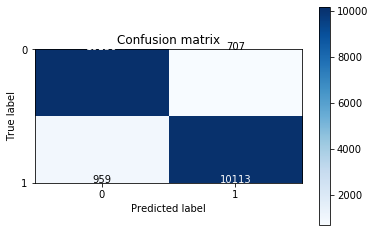

# Machine Learning Classification - Telemarketing Data

Predictive Model to help  telemarketing team concentrate resources on more promising clients first.

Model Comparison:
- Linear Regression
- KNeighbors
- SVM: Support Vector Machines
- Decision Trees
- Random Forest Classifier

Data Source - 41,118 Bank Data between 2008 and 2013 and contains the results of a telemarketing campaign including customer’s response to the bank’s offer of a deposit contract.
- https://archive.ics.uci.edu/ml/datasets/bank+marketing


```python
import pandas as pd
import numpy as np

from sklearn import preprocessing
from sklearn.preprocessing import StandardScaler
from sklearn.feature_selection import RFE

from imblearn.over_sampling import SMOTE
from imblearn.over_sampling import SVMSMOTE

from sklearn.model_selection import train_test_split
from sklearn.metrics import f1_score

from sklearn.linear_model import LogisticRegression
from sklearn.svm import SVC
from sklearn.svm import LinearSVC                          # For large datasets
from sklearn.neighbors import KNeighborsClassifier
from sklearn.tree import DecisionTreeClassifier
from sklearn.ensemble import RandomForestClassifier

from sklearn.metrics import classification_report
from sklearn.metrics import confusion_matrix

import itertools
import matplotlib.pyplot as plt

```


```python
df=pd.read_csv('data/bank_telemarketing_data.csv',delimiter=',') #, decimal=','
df.head()
#df.shape
```


<div>
<style scoped>
    .dataframe tbody tr th:only-of-type {
        vertical-align: middle;
    }

    .dataframe tbody tr th {
        vertical-align: top;
    }

    .dataframe thead th {
        text-align: right;
    }
</style>
<table border="1" class="dataframe">
  <thead>
    <tr style="text-align: right;">
      <th></th>
      <th>age</th>
      <th>job</th>
      <th>marital</th>
      <th>education</th>
      <th>default</th>
      <th>housing</th>
      <th>loan</th>
      <th>contact</th>
      <th>month</th>
      <th>day_of_week</th>
      <th>...</th>
      <th>campaign</th>
      <th>pdays</th>
      <th>previous</th>
      <th>poutcome</th>
      <th>emp.var.rate</th>
      <th>cons.price.idx</th>
      <th>cons.conf.idx</th>
      <th>euribor3m</th>
      <th>nr.employed</th>
      <th>y</th>
    </tr>
  </thead>
  <tbody>
    <tr>
      <td>0</td>
      <td>56</td>
      <td>housemaid</td>
      <td>married</td>
      <td>basic.4y</td>
      <td>no</td>
      <td>no</td>
      <td>no</td>
      <td>telephone</td>
      <td>may</td>
      <td>mon</td>
      <td>...</td>
      <td>1</td>
      <td>999</td>
      <td>0</td>
      <td>nonexistent</td>
      <td>1.1</td>
      <td>93.994</td>
      <td>-36.4</td>
      <td>4.857</td>
      <td>5191.0</td>
      <td>no</td>
    </tr>
    <tr>
      <td>1</td>
      <td>57</td>
      <td>services</td>
      <td>married</td>
      <td>high.school</td>
      <td>unknown</td>
      <td>no</td>
      <td>no</td>
      <td>telephone</td>
      <td>may</td>
      <td>mon</td>
      <td>...</td>
      <td>1</td>
      <td>999</td>
      <td>0</td>
      <td>nonexistent</td>
      <td>1.1</td>
      <td>93.994</td>
      <td>-36.4</td>
      <td>4.857</td>
      <td>5191.0</td>
      <td>no</td>
    </tr>
    <tr>
      <td>2</td>
      <td>37</td>
      <td>services</td>
      <td>married</td>
      <td>high.school</td>
      <td>no</td>
      <td>yes</td>
      <td>no</td>
      <td>telephone</td>
      <td>may</td>
      <td>mon</td>
      <td>...</td>
      <td>1</td>
      <td>999</td>
      <td>0</td>
      <td>nonexistent</td>
      <td>1.1</td>
      <td>93.994</td>
      <td>-36.4</td>
      <td>4.857</td>
      <td>5191.0</td>
      <td>no</td>
    </tr>
    <tr>
      <td>3</td>
      <td>40</td>
      <td>admin.</td>
      <td>married</td>
      <td>basic.6y</td>
      <td>no</td>
      <td>no</td>
      <td>no</td>
      <td>telephone</td>
      <td>may</td>
      <td>mon</td>
      <td>...</td>
      <td>1</td>
      <td>999</td>
      <td>0</td>
      <td>nonexistent</td>
      <td>1.1</td>
      <td>93.994</td>
      <td>-36.4</td>
      <td>4.857</td>
      <td>5191.0</td>
      <td>no</td>
    </tr>
    <tr>
      <td>4</td>
      <td>56</td>
      <td>services</td>
      <td>married</td>
      <td>high.school</td>
      <td>no</td>
      <td>no</td>
      <td>yes</td>
      <td>telephone</td>
      <td>may</td>
      <td>mon</td>
      <td>...</td>
      <td>1</td>
      <td>999</td>
      <td>0</td>
      <td>nonexistent</td>
      <td>1.1</td>
      <td>93.994</td>
      <td>-36.4</td>
      <td>4.857</td>
      <td>5191.0</td>
      <td>no</td>
    </tr>
  </tbody>
</table>
<p>5 rows × 21 columns</p>
</div>


```python
# Clean the data

#df.isnull().sum()
#df.dropna(subset = ['feature_name'], inplace=True)
```


```python
# Transform non-numerical labels of the categorical variables to numerical and convert to integers

num = preprocessing.LabelEncoder()

num.fit(["admin.","blue-collar","entrepreneur","housemaid","management",
         "retired","self-employed","services","student","technician","unemployed","unknown"])
df['job']=num.transform(df['job']).astype('int')

num.fit(["divorced","married","single","unknown"])
df['marital']=num.transform(df['marital']).astype('int')

num.fit(["basic.4y","basic.6y","basic.9y","high.school","illiterate","professional.course","university.degree","unknown"])
df['education']=num.transform(df['education']).astype('int')

#housing_loan
num.fit(["no","yes","unknown"])
df['housing']=num.transform(df['housing']).astype('int')

#personal_loan
num.fit(["no","yes","unknown"])
df['loan']=num.transform(df['loan']).astype('int')

num.fit(["failure","nonexistent","success"])
df['poutcome']=num.transform(df['poutcome']).astype('int')

num.fit(["yes","no"])
df['y']=num.transform(df['y']).astype('int')
```


```python
# Standardize the numerical values of the other features - removes mean and scales to unit variance

scaler=StandardScaler()

df['cons.price.idx'] = scaler.fit_transform(df[['cons.price.idx']]).reshape(-1,1)
df['cons.conf.idx'] = scaler.fit_transform(df[['cons.conf.idx']]).reshape(-1,1)
df['euribor3m'] = scaler.fit_transform(df[['euribor3m']]).reshape(-1,1)

```


```python
# Rank features using recursive feature elimination (RFE) method and Random Forest Classifier algorithm as estimator

X = np.asarray(df[['age', 'job', 'marital', 'education', 'housing', 'loan', 
                   'emp.var.rate', 'cons.price.idx', 'cons.conf.idx', 'euribor3m']])
y = np.asarray(df['y'])

rfc = RandomForestClassifier(n_estimators=40)
rfe = RFE(rfc, 6)
rfe_fit = rfe.fit(X, y)

print("Num Features: %s" % (rfe_fit.n_features_))
print("Selected Features: %s" % (rfe_fit.support_))
print("Feature Ranking: %s" % (rfe_fit.ranking_))
```

    Num Features: 6
    Selected Features: [ True  True False  True False False  True False  True  True]
    Feature Ranking: [1 1 3 1 2 4 1 5 1 1]
    


```python
X = np.asarray(df[['age', 'job', 'marital','education', 'housing',
                   'emp.var.rate','cons.conf.idx', 'euribor3m']])
y = np.asarray(df['y'])
```


```python
# Check for class imbalance
df['y'].value_counts()
```


    0    36548
    1     4640
    Name: y, dtype: int64


```python
# Oversampling : you duplicate the observations of the minority class to obtain a balanced dataset.
# Undersampling : you drop observations of the majority class

# oversampling is BETTER because you keep all the information in the training dataset.

# SMOTE - Synthetic Minority Over-sampling Technique

#sm=SMOTE(sampling_strategy='auto') #ratio='auto', #kind='regular' - Deprecated
sm=SVMSMOTE(sampling_strategy='auto')   #SVMSMOTE to use old version
X_sampled,y_sampled=sm.fit_sample(X,y)
```


```python
X_train,X_test,y_train,y_test = train_test_split(X_sampled,y_sampled,test_size=0.3,random_state=0)
```


```python
lr = LogisticRegression(C=1, solver='lbfgs')
knc = KNeighborsClassifier(n_neighbors=8)
dtree = DecisionTreeClassifier(criterion="entropy", max_depth=4)
svc = SVC(gamma='auto')
```


```python
# *** SVM takes long to run

for i in (lr,knc,dtree,rfc,svc):    #svc F1 score == 
        i.fit(X_train,y_train)
        print (i.__class__.__name__, 'F1 score =', f1_score(y_test,i.predict(X_test)))
```

    LogisticRegression F1 score = 0.7883173722754259
    KNeighborsClassifier F1 score = 0.8574911947981577
    DecisionTreeClassifier F1 score = 0.8346712449538305
    RandomForestClassifier F1 score = 0.9238991412388088
    SVC F1 score = 0.8260141421659843
    


```python
yhat = rfc.predict(X_test)
print(classification_report(y_test,yhat))
```

                  precision    recall  f1-score   support
    
               0       0.91      0.93      0.92     10857
               1       0.93      0.91      0.92     11072
    
        accuracy                           0.92     21929
       macro avg       0.92      0.92      0.92     21929
    weighted avg       0.92      0.92      0.92     21929
    
    


```python
def plot_confusion_matrix(cm, classes,
                          normalize=False,
                          title='Confusion matrix',
                          cmap=plt.cm.Blues):
    
    plt.imshow(cm, interpolation='nearest', cmap=cmap)
    plt.title(title)
    plt.colorbar()
    tick_marks = np.arange(len(classes))
    plt.xticks(tick_marks, classes)
    plt.yticks(tick_marks, classes)

    fmt = '.2f' if normalize else 'd'
    thresh = cm.max() / 2.
    for i, j in itertools.product(range(cm.shape[0]), range(cm.shape[1])):
        plt.text(j, i, format(cm[i, j], fmt),
                 horizontalalignment="center",
                 color="white" if cm[i, j] > thresh else "black")

    plt.ylabel('True label')
    plt.xlabel('Predicted label')
    plt.show()

plot_confusion_matrix(confusion_matrix(y_test, yhat), classes=['0','1'],normalize= False,  title='Confusion matrix')
```




